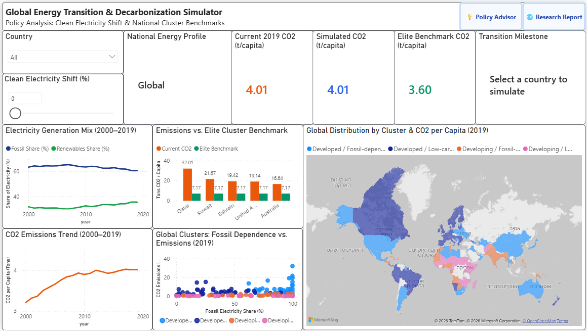

## Somalia gets 95% of its energy from renewables. Iceland gets 81%.

### Only one of them is a success story — can you guess which one?

---

Here are two countries, side by side.

**Somalia.** 95% of its total energy comes from renewable sources. Almost nothing it burns is oil or coal.

**Iceland.** Only 81% renewable. 

By the single number that every climate headline uses — *share of renewable energy* — Somalia is greener than Iceland, right? It's even Greener than Denmark. 
Somalia seems to be greener than every country you'd think of.

Now here's the number that nobody refers to in the headlines: *The share of people who cook with clean fuel* (instead of burning wood, charcoal, or dung indoors):

**Iceland: 100%. Somalia: 2.9%.**

Somalia isn't running on wind farms, It's running on firewood. According to our data — only 49% of Somalis had an electricity connection in 2019. Somalia's "renewable energy" is a family in a hut with a cooking fire and very little to no electricity. Iceland's renewable energy is a modern industrial economy that happens to sit on a geothermal jackpot.

And Somalia is not a cherry-picked outlier. Here are the fifteen countries with the highest renewable share in the world, with their clean cooking access beside it:

**The fifteen highest renewable shares in the world, 2019**

| Country | Renewable share % | Clean cooking % |
|---|---:|---:|
| Somalia | 95.0 | 2.9 |
| Central African Republic | 91.3 | 0.7 |
| Uganda | 90.2 | 0.5 |
| Gabon | 89.9 | 87.8 |
| Ethiopia | 88.9 | 7.0 |
| Liberia | 87.2 | 0.4 |
| Guinea-Bissau | 86.2 | 1.0 |
| Burundi | 84.8 | 0.2 |
| Zambia | 84.5 | 11.2 |
| Madagascar | 82.8 | 0.9 |
| Bhutan | 82.3 | 79.4 |
| Zimbabwe | 81.5 | 30.1 |
| Nigeria | 81.4 | 12.9 |
| Iceland | 81.1 | 100.0 |
| Niger | 80.8 | 2.3 |

**Eleven of the fifteen have clean cooking access below 15%.** Uganda is at 0.5%, Liberia at 0.4%, Burundi at 0.2%. The four exceptions — Iceland, Gabon, Bhutan and Zimbabwe.


### But why is the clean cooking metric so important? 

it's crucial because not all "renewable" energy is clean or modern. Official global statistics often count traditional fuels like firewood as renewable simply because plants and trees can grow back.

However, this kind of energy is dangerous: household air pollution was linked to roughly 2.9 million deaths in 2021 (WHO).

The problem is that current statistics "punish" progress: If a developing country gives millions of families cleaner gas stoves, it saves lives and forests. But because gas is a fossil fuel, the country's official "renewable" score actually drops — making genuine human progress look like a step backward.


This is the moment we started addressing our project as a real problem-solving issue. Because if the headline metric can rank a country with no power grid above one of the richest countries on earth, then **the way we usually talk about energy is broken.** And if it's broken, then the advice that follows from it — *go renewable* — is being handed out irresponsibly to 176 countries as if it means the same thing to all of them.

**It doesn't**. And we wanted to prove it with data, then build something better in its place.

---

## Why energy, and why now

Energy is the most basic thing there is: it's what turns a country's effort into a country's output. It runs the hospital fridge holding the vaccines. It runs the pump that brings water. It decides whether a student can read after sunset.

That makes it three problems at once, and they all pull in different directions:

- **An environmental problem.** Burning things heats the planet - and that's bad.
- **An economic problem.** Energy is an input to literally everything, so its price is a tax on everything.
- **A security problem.** A country that imports its energy has handed a stranger the power to switch it off.

Every government on earth is making decisions on this right now, spending hundreds of billions of dollars, and mostly getting one piece of advice: *build renewables.*

We think that we were used to asking the wrong question. "What is the best energy source?" is a debate. **"What is the right energy source and the right mix of energy sources *for this specific country*?"** is a question you can actually answer with data — and it's the only version of the question a decision-maker can act on.

That was our goal: stop arguing about what's best, and build a real analytical framework for decision makers that tells each country what's right for *it*.

---

## The data: 176 countries, 20 years, and four things we had to fix first

We used a public dataset called **Global Data on Sustainable Energy**. It covers **176 countries from 2000 to 2020**, with roughly twenty measurements per country per year: how much electricity comes from fossil fuels, nuclear and renewables; carbon emissions; GDP; energy efficiency; how many people have electricity; how many cook with clean fuel and so on.

That's about 3,500 country-years of the world's energy life.  Like every dataset, it was quietly booby-trapped.

Four traps, and what we did about them:

**1. The year 2020 is a lie.** Reporting for 2020 is drastically incomplete — COVID broke the collection pipeline, not just the world. A chart ending in 2020 would show a beautiful "drop in emissions" that is mostly countries failing to file paperwork. **We deleted 2020 entirely** and treat **2019** as the present.

**2. Population is frozen.** The file gives each country a population density and a land area — but these are *single, fixed values*, not yearly ones. We checked: every country has exactly one population value across all twenty years. So any "emissions per person" figure we compute uses a recent population for the year 2000 too. That makes it perfectly fine for **comparing countries in one year**, and completely wrong for claiming *"emissions per person rose since 2000."* We never make that claim. Trends are reported as totals; per-capita figures are used only for cross-country comparison.

**3. Two of the variables are the same variable.** "Fossil share of electricity" and "low-carbon share of electricity" add up to exactly 100 — they're mirror images. 

**4. There is no "world total."** Only 159–163 countries report emissions in any given year. So every chart we label as a total is a *sample* total, and we say so on the chart.

> *Traps 2, 3 and 4 are checked in code rather than asserted — the notebook runs each one as an explicit sanity check and prints the result.*

And here is the whole dataset in one table: nine key variables, how they're spread across all 3,474 country-years, and how much of each is missing.

**Table 1 — Descriptive statistics for nine key variables, 2000–2019**

| Variable | Missing % | Mean | Std | Min | Median | Max |
|---|---:|---:|---:|---:|---:|---:|
| Access to electricity (%) | 0.3 | 78.6 | 30.5 | 1.3 | 98.1 | 100.0 |
| Access to clean cooking fuel (%) | 4.6 | 63.0 | 39.1 | 0.0 | 82.9 | 100.0 |
| Renewable share of final energy (%) | 0.6 | 32.6 | 29.9 | 0.0 | 23.3 | 96.0 |
| Low-carbon electricity (%) | 1.2 | 36.6 | 34.4 | 0.0 | 27.6 | 100.0 |
| Energy consumption per capita (kWh) | 0.0 | 25,828 | 34,923 | 0 | 13,119 | 262,586 |
| Energy intensity (MJ per $) | 0.9 | 5.31 | 3.53 | 0.11 | 4.30 | 32.57 |
| GDP growth (%) | 8.7 | 3.84 | 5.30 | −62.08 | 3.78 | 123.14 |
| GDP per capita (US$) | 7.7 | 13,195 | 19,601 | 112 | 4,538 | 123,514 |
| CO2 emissions (kt) | 7.3 | 159,866 | 773,661 | 10 | 10,500 | 10,707,220 |

---

# Act I — What does the world actually look like?

Before you can explain anything, you have to look. So we started by simply presenting the world's energy over twenty years, from different perspectives — with a couple of quick tests along the way, just to confirm that what we were seeing was real and not noise.

Four things jumped out.

**Finding 1: The renewable revolution is real. It's also losing.**


Renewable electricity generation grew **2.6× between 2000 and 2019.** That's an extraordinary build-out.

In contrast, the fossil fuel share of the world's electricity went from **63.9% to 62.4%.**

**One and a half percentage points. In twenty years.**

Not because renewables failed, but because the denominator ran away. Fossil generation *also* grew — 1.7× — because the world kept wanting more electricity, and renewables mostly served the *growth* rather than replacing what was already there.

The same arithmetic hit nuclear from the other side. Nuclear generation actually *grew* 5% over the twenty years — yet its share of the world's electricity nearly halved.

**Finding 2: Emissions in our sample rose 48%** — from about 20 to 29.6 gigatons a year.

These emissions are spread very unevenly. In 2019, a typical country **produced 2.5 tons of carbon per person**, while many produced less than one ton. At the extremes, an average person in Qatar created 32 tons — about 740 times more than someone in Somalia (0.04 tons).

**Table 3 — Distribution of emissions per capita, 2019**

| Emissions per capita, 2019 | tons |
|---|---:|
| Countries reporting | 159 |
| Mean | 4.02 |
| Median | 2.54 |
| Lowest quarter, below | 0.75 |
| Highest quarter, above | 5.41 |
| Minimum (Somalia) | 0.04 |
| Maximum (Qatar) | 32.01 |


**Finding 3: But something *did* work — spectacularly.**

**Table 2 — Cross-country averages, 2000 vs 2019**

| Cross-country average | 2000 | 2019 | Change |
|---|---:|---:|---:|
| Access to electricity (%) | 73.1 | 84.8 | **+11.6** |
| Access to clean cooking fuel (%) | 58.1 | 67.2 | **+9.1** |
| Energy intensity (MJ per $) | 6.28 | 4.53 | **−1.76** |
| GDP per capita (US$) | 7,365 | 16,177 | **+8,812** |

Access to electricity rose by an average of **11.6 percentages** per country. And when we compared each country against *itself* in 2000 and 2019: **113 countries improved. One got worse.** (The 56 that show no change were already at 100% in 2000)

This is the biggest untold success story in the data, and it matters for the argument: it proves that energy outcomes *are* movable. Countries are not stuck with what they have.

> *Also Based on: **hypothesis test H3** — a paired t-test on the 170 countries with data in both years, plus a chi-square test on how many improved versus declined.*

**Finding 4: The world got better at using energy**

There's one more number in the table, and it's the one nobody puts in a headline: *energy intensity* — how much energy a country burns to produce one dollar of output. Think of it as miles per gallon, for an entire economy.

Between 2000 and 2019 it fell by 28%. Comparing each country against itself, 132 improved and 37 got worse. The world is now producing roughly 40% more output from the same energy.

That matters because it's a second lever, and a quieter one. A country can cut its emissions by changing what it burns — or by needing less of it in the first place. 

> *Also Based on: **hypothesis test H4** — the same paired design as H3, applied to energy intensity.*

---

### The rest of the picture

**The two extremes of the ranking tell the same story from both ends.** *(V4, V5)* At the bottom of the renewable ranking sit Bahrain, Oman, Saudi Arabia, Qatar and Kuwait — all below 0.1%. At the top of the emissions-per-capita ranking sit largely the same countries. **Eight of the fifteen lowest-renewable countries are also among the fifteen highest emitters per person.**


**Renewable share by continent.** *(V3)* Africa's spread is enormous — some countries near 95%, others near zero. The continent averages hide more than they show, which is one reason we later stopped grouping countries by geography at all.


**What moves with what.** *(V6)* A correlation heatmap of ten variables. The strongest relationship in the whole dataset is between how much energy a person uses and how much carbon they emit — 0.95, almost a straight line. Income sits right behind it. This is the same story Act II will tell with models: emissions follow consumption and wealth far more closely than they follow anything about the grid.


**Income against renewable share.** *(V7)* Every country, coloured by continent. Worth a moment of look.


---

That's the end of Act I, and it leaves us with a specific problem: if the simple metric is broken, we need to test what the energy mix *actually does*.


# Act II — Does the energy mix actually do anything?

Now we stop describing and start testing. The question changes from "what does the world look like?" to **"does changing your energy mix actually change your outcomes?"**

### A quick word on what a statistical test is

You don't need any math for the rest of this. Just one idea.

When we say a result is **significant**, we're answering one question: *if there were really no connection here, how often would data like ours show up by pure luck?* If the answer is "less than 5 times in 100" (a p-value below 0.05), we call it a real signal. That's it. 


### Hypothesis Test 1: The lesson that made us better at this

We asked the simplest question in the project: **do countries with fossil-heavy grids emit more carbon per person?**

Obviously yes, right?

We split the 153 countries into two groups — above and below the median fossil share — and compared them. The result: **not significant** (p = 0.15). Statistically, we could not tell the two halves apart.

That should have been the end of it. 
Instead we ran the same question a second way: instead of chopping countries into "high" and "low," we used the fossil share **as the actual number it is**, and measured the correlation. Result: *significant* (r = 0.175, p = 0.031).

Same data. Same question. Different answer.

```
H1a | Two groups, split at the median fossil share
      Median emissions: 3.31 vs 1.82 tons per capita
      Welch t = 1.462, p = 0.1458          <- not significant

H1b | The fossil share used as a continuous number
      r = 0.175, p = 0.0307                <- significant

H1c | How much of the variation does each variable explain?
      Fossil share of the grid : r^2 =  3.1%
      GDP per capita           : r^2 = 78.7%
```

The first test failed because splitting at the median throws away almost everything you know. A country at 51% fossil and a country at 99% fossil get treated as identical twins.

**Remember that failure — it's the whole project in a nutshell**. Dividing countries into only two simple categories made it impossible to see the real trend. 

But now look closely at the test that did work, because it's saying something uncomfortable. A correlation of 0.175 means the fossil share of a country's grid explains about **3% of the difference in CO2 emissions per-capita between countries**. Income alone explains **79%**.

Energy debates focus on the wrong thing. Clean power grids help, but overall consumption matters much more — a wealthy country using clean energy can still pollute more than a poor coal-powered one just by using way more stuff.

That’s why looking only at the grid doesn’t work. To find real solutions, our models look at the whole picture: wealth, energy use, and efficiency combined.

### Hypothesis Tests 2, 3 and 4, briefly

- **Do continents use different amounts of renewable energy?** Yes, by a lot. Africa averages 55% renewables, while every other continent is between 18% and 31%. But Africa also has the widest internal gap, meaning that simple average doesn't actually describe most individual African nations. This shows that grouping countries just by continent doesn't tell the whole story — an idea we'll explore in Act III.
- **Did global access to electricity truly improve?** Yes. By comparing each country directly to its own past record, we confirmed the progress is real, not just random fluctuation.
- **And did the world get better at using energy?** The world became significantly better at getting more economic value per unit of energy used. But it's not a universal win: while most improved, roughly 20% of countries actually became less efficient over the past two decades.
  
### The models: five questions, one framework

Then we built five regression models. The regression is just an organized way of asking: *holding everything else steady, what does **this one thing** do?*

We asked each model the same core question, in a specific form: **if a country moved one percentage point of its electricity grid off fossil fuels and onto something else, what happens?**


**Summary Table - Effect of shifting one percentage point of the grid, all five models**

| We asked… | Moving 1 percentage point of the grid to renewables | …to nuclear |
|---|---|---|
| …emissions per person, comparing countries | **−0.87%** | −0.90%, but too uncertain to call |
| …emissions per person, comparing a country to its own past | **−0.53%** | nothing |
| …economic growth | nothing | nothing |
| …energy efficiency | **improves by 0.26%** | **worsens by 0.24%** |
| …access to clean cooking fuel | nothing | **improves** |

> *Bold means the result is solid enough to trust. "Nothing" means the data showed no effect either way — which is a finding in itself, not a gap.*

Five insights worth pulling out:

**1. Cleaning up the power grid helps, but it takes time.** By tracking how countries changed over time compared to their own past records, the math is clear: replacing 10% of fossil fuels with renewables cuts emissions per person by about 5%. It’s real progress, but far slower than the hype suggests. Signing a solar deal doesn't fix things overnight.

**2. Going green won't hurt the economy.** We found no evidence that switching to clean energy slows down economic growth. Across 20 years of data from 154 countries, there is zero sign of an economic penalty for cutting emissions. Anyone claiming that green energy destroys growth now has to prove it.

**3. A cleaner grid comes with a leaner economy — not a wasteful one.** Countries with more renewable electricity get more output per unit of energy. The "green energy is a luxury that burns resources" story doesn't survive contact with the data. Curiously, nuclear runs the other way: reactor-heavy countries are slightly *less* efficient, which likely says more about what kind of economy builds  nuclear reactors — heavy industry & energy-hungry manufacturing.

**4. Nuclear power is a sign of a strong system, not the direct cause.** Nuclear energy showed only a weak link to lower emissions, but a surprisingly strong link to things like households having clean cooking fuel. Why? Because nuclear power isn't directly putting clean stoves in kitchens — rather, countries with the money and advanced infrastructure to build nuclear reactors are the same countries that can easily provide modern utilities to their citizens.

**5. Above all: Wealth drives emissions.** The single biggest factor behind a country's carbon footprint isn't how it makes power — it's how rich it is. As national income rises, so do emissions. Cleaning the grid helps, but wealth is a much bigger force. This is why a "one-size-fits-all" climate policy fails: a country's emissions depend far more on its level of wealth than on its energy sources.

Act II gives us the ingredients. It does not yet give anyone advice. For that we need to stop treating the world as one place.

---

# Act III — Four kinds of country

Fixing the grid is helpful, but a country's wealth matters much more than its energy source. Because of this, climate advice has to be tailored to each country.

But depending on *what*, exactly? That's the question we had to answer without cheating — because it would be very easy to sort countries into whatever categories we already believed in, then present our own assumptions back as a finding.

So we didn't sort them. We described each country in 2019 by five numbers: how much carbon it emits per person, how much of its electricity comes from fossil fuels, how rich it is, how efficiently it uses energy, and how much energy each person actually consumes. Then we handed those numbers to a Machine Learning algorithm that knows nothing else — no country names, no continents, no politics, no development labels — and asked it a single question: **which of these 144 countries resemble each other?**

Whatever came back would be the data's answer, not ours.
Or that was the plan.

It came back with four groups.


**The four national energy profiles (cluster medians)**

| Profile | Countries | Emissions/person | Fossil grid | Income | Who's in it |
|---|---|---|---|---|---|
| **0 — Developing, clean grid** | 24 | 0.2 t | 41% | $773 | Ethiopia, Kenya, Uganda, Zambia |
| **1 — Developing, fossil grid** | 37 | 0.9 t | 75% | $2,820 | India, Nigeria, Pakistan, Morocco |
| **2 — Developed, clean grid** | 42 | 4.0 t | 33% | $18,530 | France, Brazil, Sweden, Canada |
| **3 — Developed, fossil grid** | 41 | 6.3 t | 93% | $10,562 | USA, China, Japan, Poland, **Israel** |

### A confession about the number four

We should be straight about something: the algorithm didn't hand us four groups. We asked for four.

There's a standard way to let the data choose. You try every number of groups and measure how cleanly each one separates — how much each country resembles its own group compared to the nearest rival. Higher is better.


Run that here and the winner is **two**. And those two groups turn out to be, almost exactly, rich countries and poor ones. Look at where the dashed line sits on that second curve: our choice of four is at the bottom of it.

Which is the third time this project has arrived at the same place. The models said wealth dominates everything. The correlation test said income explains the outcome far better than the grid does. And now an algorithm that was told nothing about our theories independently splits the world along the same line.

But telling countries to 'just get richer' isn't real advice. So we looked deeper, but dividing countries into anywhere between 4 and 8 groups gave almost the exact same results. The data can't take us any further—it doesn't favor one number of groups over another.

So the choice moved to us, and we made it on three grounds.

**Four groups mean something you can say out loud.** They're two familiar questions crossed: is this country rich or poor, and is its is mostly electricity clean or fossil.

**Fair comparisons need enough countries.** To evaluate each country fairly, we compare it to the leaders in its group. If we use eight groups, the smallest has only seven countries, meaning a country is compared to just one top performer. That’s an isolated example, not a fair comparison.

**Dividing into three groups looked slightly better in the math, but made zero sense in reality.** It treats all developing nations as identical, wipes out the difference between clean and dirty power in poorer regions, and lumps India in with the US. Having a neat graph isn't worth giving India the same targets as America. A cleaner statistical result isn't worth a flawed model that gives India the same assignments as America.

One more honesty note. These four groups aren't natural kinds waiting to be discovered. They're overlapping regions of a map, and the countries near a boundary could reasonably have gone either way. We're not claiming the world *is* four things. We're claiming these four descriptions are useful — and the rest of this act is the argument for why.

### Two things about that table are more interesting than the table

**First: geography constrains, but it doesn't decide.** Every profile appears on at least three continents, and **Africa, Asia and North America each contain all four.** Europe and South America are the exceptions that prove the point — each holds only the two developed profiles, split between clean grids and fossil ones. So knowing a country's continent narrows things down, but it never gets you to an answer.

**Being rich is not the same as being green.** Wealth and clean power are completely separate. A country can have a low income but a very clean grid (Ethiopia), or be rich while relying almost entirely on fossil fuels (Israel, at 96%). Growing the economy and switching to clean energy are two different problems—every country needs to know which one it is trying to solve.

### From map to advice

A map is nice. A decision-maker needs a next step. So we built one.

Setting arbitrary energy targets doesn't work. Instead, we created realistic benchmarks by taking the top 20% most carbon-efficient countries in each group—the ones getting the highest economic output with the least pollution—and making their average the goal. Nobody has to become Norway all of a sudden; Each country is simply measured against similar ones.

By combining this with data on how individual countries actually perform when they clean up their power, our simulator answers two practical questions:

- How much clean energy does a country need in order to reach its group's top standard?
- How much must it change to move up into a whole new category?

Here's an example of what came back.

```
========================================================================
Policy recommendation: Israel
Current profile: Cluster 3 - developed / fossil-dependent
Status: 4.0% clean electricity | 7.54 tons CO2 per capita
------------------------------------------------------------------------
[A] Cluster elite target: 7.17 tons/capita
    Gap: +0.37 tons. A shift of 9.5% of the grid is required.

[B] Minimum shift that moves the country to a better profile:
    Shift 18% of the grid from fossil to clean
    New profile: cluster 2 - developed / low-carbon electricity
    Predicted emissions: 6.86 tons/capita
========================================================================
Policy recommendation: India
Current profile: Cluster 1 - developing / fossil-dependent
Status: 21.5% clean electricity | 1.61 tons CO2 per capita
------------------------------------------------------------------------
[A] Cluster elite target: 0.86 tons/capita
    Gap: +0.75 tons.
    That is more than the existing fossil share, so the mix alone
    cannot close the gap.

[B] Minimum shift that moves the country to a better profile:
    Even a complete removal of fossil fuels does not change the profile.
    Meaning: the barrier is not the production mix but energy intensity
    or the level of consumption.
========================================================================
Policy recommendation: France
Current profile: Cluster 2 - developed / low-carbon electricity
Status: 90.5% clean electricity | 3.92 tons CO2 per capita
------------------------------------------------------------------------
[A] Cluster elite target: 4.54 tons/capita
    The country already meets the elite target of its cluster.

[B] Minimum shift that moves the country to a better profile:
    Even a complete removal of fossil fuels does not change the profile.
    Meaning: the barrier is not the production mix but energy intensity
    or the level of consumption.
========================================================================
Policy recommendation: Ethiopia
Current profile: Cluster 0 - developing / low-carbon electricity
Status: 99.9% clean electricity | 0.14 tons CO2 per capita
------------------------------------------------------------------------
[A] Cluster elite target: 0.08 tons/capita
    Gap: +0.07 tons.
    That is more than the existing fossil share, so the mix alone
    cannot close the gap.

[B] Minimum shift that moves the country to a better profile:
    Even a complete removal of fossil fuels does not change the profile.
========================================================================
```

Here is one country from each of the four groups. Put them side by side, and it’s clear they face completely different challenges:

**Israel** — The gap to its peers is small. Shifting just 9.5% of its power grid to clean energy closes it, and shifting 18% moves Israel into an entirely better category. For a sunny country, this is a straightforward, actionable goal.

**India** — The model reveals a surprise: even getting rid of fossil fuels entirely wouldn't move India into a better category. This isn’t because progress is impossible, but because the power grid isn't the real bottleneck. India uses far more energy per dollar of economic output than its peers. Focusing purely on power plants targets the wrong problem—efficiency is the real battle.

**France** — already beats its peer benchmark, and no amount of grid shifting changes its profile, because there's barely any fossil left to shift. The advice reduces to: *the grid is no longer your problem.* What remains is consumption and efficiency — a different fight needing different tools.

**Ethiopia** — Look at what happens with a country whose power grid is already 99.9% clean. Since there are no fossil fuels left to cut, the model mechanically suggests cutting emissions even further (from 0.14 to 0.08 tons per person). For a country where half the people lack basic electricity, that isn't practical policy—it's a breakdown of the model itself. We chose to highlight this flaw to expose the limits of our policy simulator. 

**The bottom line:** The command to "switch to renewables" is spot-on for Israel, misdirected for India, obsolete for France, and absurd for Ethiopia. Different realities demand different solutions.

---
### Two tools you can use yourself

We showed four countries above as an examples. To make the framework usable for any of them, we built two tools that cover all 144 countries in the analysis.

### Two tools you can use yourself

We showed four countries above. To make the framework usable for any of them, we built two tools that cover all 144 countries in the analysis.



**The dashboard.** Choose a country and it shows that country's energy profile, its current emissions per person, and the benchmark set by the best performers in its group. A slider lets you shift part of its grid from fossil to clean and see the predicted result.

**The policy advisor.** A simple page that gives the full written recommendation for any country: which group it belongs to, how far it is from its benchmark, and how much of its grid it would need to shift.

**The dashboard.** Choose a country and it shows that country's energy profile, its current emissions per person, and the benchmark set by the best performers in its group. A slider lets you shift part of its grid from fossil to clean and see the predicted result.

**The policy advisor.** A simple page that gives the full written recommendation for any country: which group it belongs to, how far it is from its benchmark, and how much of its grid it would need to shift.

---
## What this cannot tell you

Honest Limits of This Analysis:

**Correlation vs. Causation:** We tracked relationships over time, not guaranteed cause-and-effect.

**Our 4-group model is a practical choice:** The data itself doesn't demand four groups; we chose this breakdown because it is useful and realistic.

**The benchmark breaks down for the poorest nations:** In the low-income, clean-energy group, countries score well simply because their economies are tiny. As a result, the model absurdly tells Ethiopia to emit even less than it currently does. This reveals a key limit of our framework: it helps countries choosing how to clean up their energy, not those struggling to provide basic electricity.

**The data has gaps:** Out of 176 countries, our models analyzed 154 (and 144 for clustering) — often the most vulnerable or unstable could not be included due to lack of reliable data.

---

## So what did 20 years of data actually say?

**The headline metric is broken.** "Share of renewable energy" ranks Somalia above Iceland, because firewood and geothermal count as the same thing. Any strategy built on that number is aiming at the wrong target.

**Progress is real and it is losing on points.** Renewable generation grew 2.6× — and the fossil share of the world's electricity barely moved, from 63.9% to 62.4%, while total emissions rose 48%. Both facts are true at once because demand grew too. Building clean energy is not the same as displacing dirty energy.

**Real progress is possible.** Nearly every nation that needed to expand basic electricity access succeeded, with only a single country moving backward. Things are not frozen, and nations are not trapped in their past.

**Clean power is safe for growth.** Replacing 10% of fossil fuels with renewables cuts emissions per person by roughly 5%, without harming the economy and while boosting efficiency.

**And the countries of the world come in four kinds, not one.** The real question was never "what is the best energy source?". it's **"what is the right path for your specific situation?"**, and the answer is entirely different for a wealthy nation on fossil fuels or a poor nation on renewables.

The most useful thing statistics did here wasn't finding an answer. It was **showing us we had been asking one question where there were four.** A single average, applied to 176 different countries, hides more than it reveals — and in a field where the wrong advice costs billions of dollars and decades, that hiding is the expensive part.

In conclusion, One-size-fits-all advice fails 176 unique countries. Somalia and Iceland were never the same story. The numbers just made them look that way.

---

*This project was completed as a guided research project for a B.Sc. in Statistics & Data Analysis at Ben-Gurion University (BGU) by the students **Nadav Salonikio** and **Nevo Ravel**. Data: [Global Data on Sustainable Energy](https://www.kaggle.com/datasets/anshtanwar/global-data-on-sustainable-energy), 176 countries, 2000–2020 (2020 excluded). Analysis in Python — pandas, statsmodels, scikit-learn. Full code and notebook available on request.*
