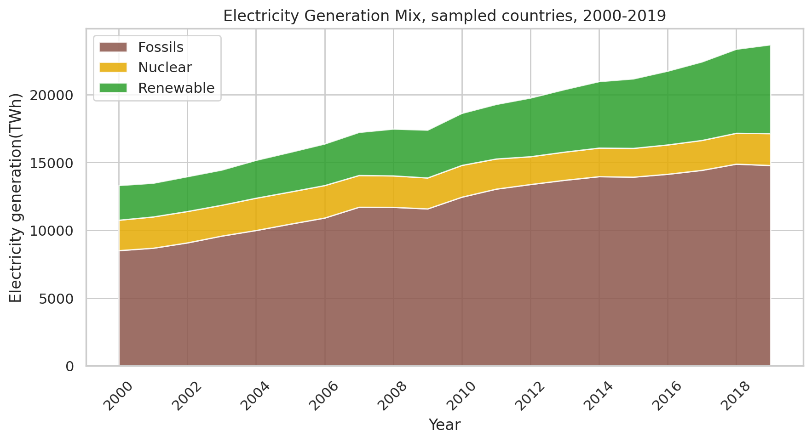
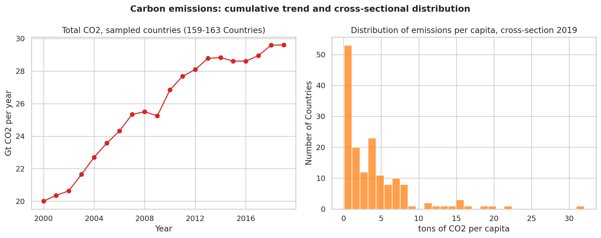
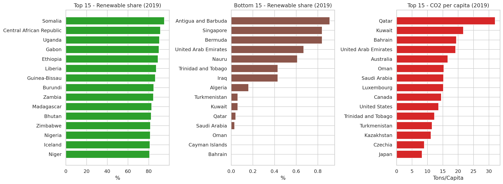
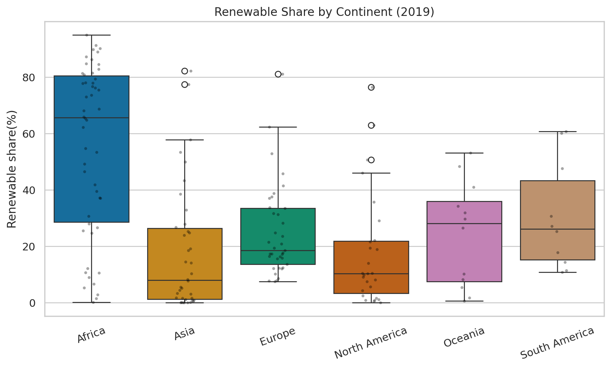
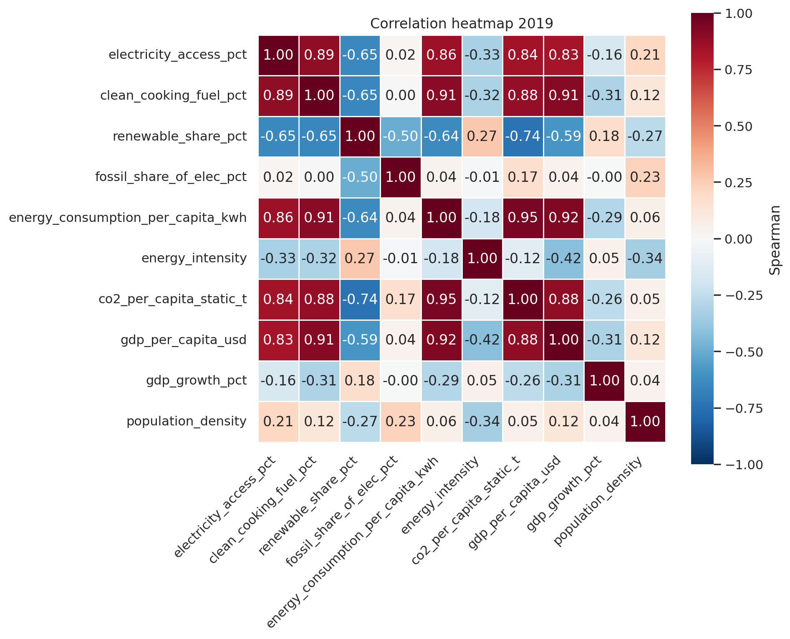
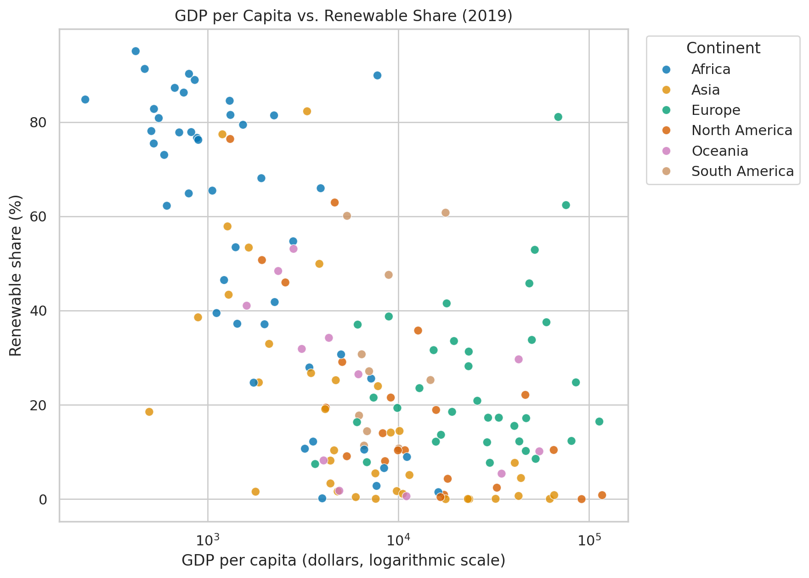
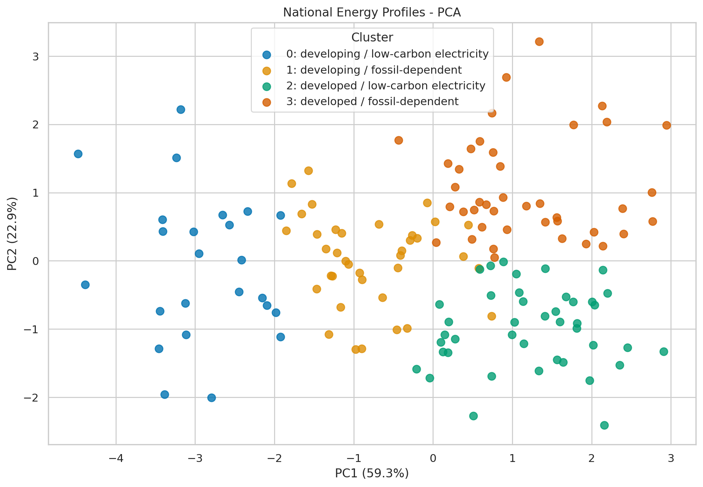
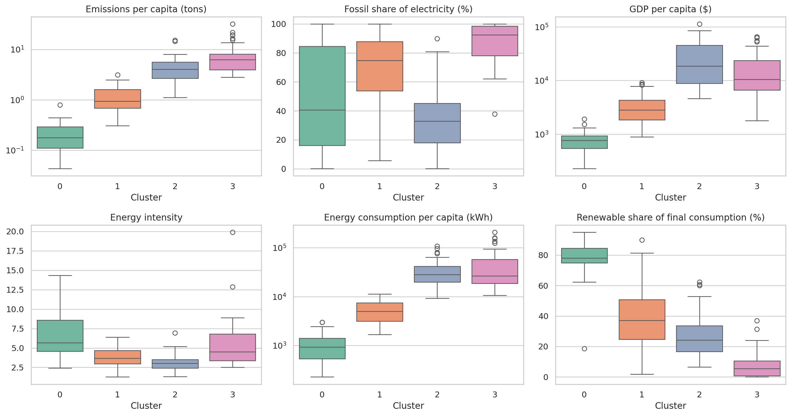
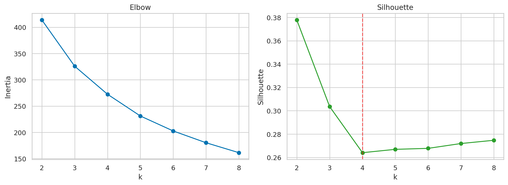

## Somalia gets 95% of its energy from renewables. Iceland gets 81%.

### Only one of them is a success story — can you guess which one?

---

Here are two countries, side by side.

**Somalia.** 95% of its total energy comes from renewable sources. Almost nothing it burns is oil or coal.

**Iceland.** 81% renewable. Volcanic steam, glacial rivers, the whole postcard.

By the single number that every climate headline uses — *share of renewable energy* — Somalia is greener than Iceland, right? Greener than Denmark. Somalia seems to be greener than every country you'd think of.

Now here's the variable that nobody refers to in the headlines: *The share of people who cook with clean fuel* (instead of burning wood, charcoal, or dung indoors):

**Iceland: 100%. Somalia: 2.9%.**

Somalia isn't running on wind farms. It's running on firewood. According to our data — only 49% of Somalis had an electricity connection in 2019. Somalia's "renewable energy" is a family in a hut with a cooking fire and no electricity. Iceland's renewable energy is a modern industrial economy that happens to sit on a geothermal jackpot.

And Somalia is not a cherry-picked outlier. Here are the fifteen countries with the highest renewable share in the world, with their clean cooking access beside it:

**The fifteen highest renewable shares in the world, 2019**

| Country | Renewable share % | Clean cooking % |
|---|---:|---:|
| Somalia | 95.0 | 2.9 |
| Central African Republic | 91.3 | 0.7 |
| Uganda | 90.2 | 0.5 |
| Gabon | 89.9 | 87.8 |
| Ethiopia | 88.9 | 7.0 |
| Liberia | 87.2 | 0.4 |
| Guinea-Bissau | 86.2 | 1.0 |
| Burundi | 84.8 | 0.2 |
| Zambia | 84.5 | 11.2 |
| Madagascar | 82.8 | 0.9 |
| Bhutan | 82.3 | 79.4 |
| Zimbabwe | 81.5 | 30.1 |
| Nigeria | 81.4 | 12.9 |
| Iceland | 81.1 | 100.0 |
| Niger | 80.8 | 2.3 |

**Eleven of the fifteen have clean cooking access below 15%.** Uganda is at 0.5%, Liberia at 0.4%, Burundi at 0.2%. The four exceptions — Iceland, Gabon, Bhutan, Zimbabwe — are the exceptions.


### But why is the clean cooking metric so important? 

it's crucial because not all "renewable" energy is clean or modern. Official global statistics often count traditional fuels like firewood as renewable simply because plants and trees grow back.

However, this kind of energy is dangerous: household air pollution was linked to roughly 2.9 million deaths in 2021 (WHO).

The problem is that current statistics punish progress: If a developing country gives millions of families cleaner gas stoves, it saves lives and forests. But because gas is a fossil fuel, the country's official "renewable" score actually drops — making genuine human progress look like a step backward.


This is the moment we started addressing our project as a real problem-solving project. Because if the headline metric can rank a country with no power grid above one of the richest countries on earth, then **the way we usually talk about energy is broken.** And if it's broken, then the advice that follows from it — *go renewable* — is being handed out irresponsibly to 176 countries as if it means the same thing to all of them.

**It doesn't**. And we wanted to prove it with data, then build something better in its place.

---

## Why energy, and why now

Energy is the most basic thing there is: it's what turns a country's effort into a country's output. It runs the hospital fridge holding the vaccines. It runs the pump that brings water. It decides whether a student can read after sunset.

That makes it three problems at once, and they all pull in different directions:

- **An environmental problem.** Burning things heats the planet - and that's bad.
- **An economic problem.** Energy is an input to literally everything, so its price is a tax on everything.
- **A security problem.** A country that imports its energy has handed a stranger the power to switch it off.

Every government on earth is making decisions on this right now, spending hundreds of billions of dollars, and mostly getting one piece of advice: *build renewables.*

We think that advice is asking the wrong question. "What is the best energy source?" is a debate. **"What is the right energy source and the right mix of energy sources *for this specific country*?"** is a question you can actually answer with data — and it's the only version of the question a decision-maker can act on.

That was our goal: stop arguing about what's best, and build a real analytical framework for decision makers that tells each country what's right for *it*.

---

## The data: 176 countries, 20 years, and four things we had to fix first

We used a public dataset called **Global Data on Sustainable Energy**, which compiles figures published by the World Bank, the International Energy Agency and Our World in Data. It covers **176 countries from 2000 to 2020**, with roughly twenty measurements per country per year: how much electricity comes from fossil fuels, nuclear and renewables; carbon emissions; GDP; energy efficiency; how many people have electricity; how many cook with clean fuel and so on.

That's about 3,500 country-years of the world's energy life. It's a great dataset. It is also, like every real dataset, quietly booby-trapped — and the boring part of this project is the part that decides whether the exciting part is true.

Four traps, and what we did about them:

**1. The year 2020 is a lie.** Reporting for 2020 is drastically incomplete — COVID broke the collection pipeline, not just the world. A chart ending in 2020 would show a beautiful "drop in emissions" that is mostly countries failing to file paperwork. **We deleted 2020 entirely** and treat **2019** as the present.

**2. Population is frozen.** The file gives each country a population density and a land area — but these are *single, fixed values*, not yearly ones. We checked: every country has exactly one population value across all twenty years. So any "emissions per person" figure we compute uses a recent population for the year 2000 too. That makes it perfectly fine for **comparing countries in one year**, and completely wrong for claiming *"emissions per person rose since 2000."* We never make that claim. Trends are reported as totals; per-person figures are used only for cross-country comparison.

**3. Two of the variables are the same variable.** "Fossil share of electricity" and "low-carbon share of electricity" add up to exactly 100 — they're mirror images. Feeding both into the same model is like weighing yourself twice and reporting 140kg. We caught it, and used only one.

**4. There is no "world total."** Only 159–163 countries report emissions in any given year. So every chart we label as a total is a *sample* total, and we say so on the chart.

*Traps 2, 3 and 4 are checked in code rather than asserted — the notebook runs each one as an explicit sanity check and prints the result.*

And here is the whole dataset in one table: nine key variables, how they're spread across all 3,474 country-years, and how much of each is missing.

**Table 1 — Descriptive statistics for nine key variables, 2000–2019**

| Variable | Missing % | Mean | Std | Min | Median | Max |
|---|---:|---:|---:|---:|---:|---:|
| Access to electricity (%) | 0.3 | 78.6 | 30.5 | 1.3 | 98.1 | 100.0 |
| Access to clean cooking fuel (%) | 4.6 | 63.0 | 39.1 | 0.0 | 82.9 | 100.0 |
| Renewable share of final energy (%) | 0.6 | 32.6 | 29.9 | 0.0 | 23.3 | 96.0 |
| Low-carbon electricity (%) | 1.2 | 36.6 | 34.4 | 0.0 | 27.6 | 100.0 |
| Energy consumption per capita (kWh) | 0.0 | 25,828 | 34,923 | 0 | 13,119 | 262,586 |
| Energy intensity (MJ per $) | 0.9 | 5.31 | 3.53 | 0.11 | 4.30 | 32.57 |
| GDP growth (%) | 8.7 | 3.84 | 5.30 | −62.08 | 3.78 | 123.14 |
| GDP per capita (US$) | 7.7 | 13,195 | 19,601 | 112 | 4,538 | 123,514 |
| CO2 emissions (kt) | 7.3 | 159,866 | 773,661 | 10 | 10,500 | 10,707,220 |

---

# Act I — What does the world actually look like?

Before you can explain anything, you have to look. So we started by simply presenting the world's energy over twenty years, from different perspectives — with a couple of quick tests along the way, just to confirm that what we were seeing was real and not noise.

Four things jumped out.

**Finding 1: The renewable revolution is real. It's also losing.**



Renewable electricity generation grew **2.6× between 2000 and 2019.** That's an extraordinary build-out — solar farms, wind, hydro, at a pace nobody predicted in 2000.

In contrast, the fossil fuel share of the world's electricity went from **63.9% to 62.4%.**

One and a half percentage points. In twenty years.

Not because renewables failed, but because the denominator ran away. Fossil generation *also* grew — 1.7× — because the world kept wanting more electricity, and renewables mostly served the *growth* rather than replacing what was already there.

The same arithmetic hit nuclear from the other side. Nuclear generation actually *grew* 5% over the twenty years — yet its share of the world's electricity nearly halved. In energy, "your share fell" and "you shrank" are two completely different statements, and the headlines almost never distinguish them.

**Finding 2: Emissions in our sample rose 48%** — from about 20 to 29.6 gigatons a year.

And they are spread with staggering unevenness. Across the 159 countries reporting in 2019, the median country emitted **2.54 tons of CO2 per person**. A quarter of them emitted less than 0.75. At one end sits Somalia, the country we opened with, at 0.04 tons. At the other, Qatar at 32.01 — a gap of roughly 740 times.

**Table 3 — Distribution of emissions per capita, 2019**

| Emissions per capita, 2019 | tons |
|---|---:|
| Countries reporting | 159 |
| Mean | 4.02 |
| Median | 2.54 |
| Lowest quarter, below | 0.75 |
| Highest quarter, above | 5.41 |
| Minimum (Somalia) | 0.04 |
| Maximum (Qatar) | 32.01 |



**Finding 3: But something *did* work — spectacularly.**

**Table 2 — Cross-country averages, 2000 vs 2019**
| Cross-country average | 2000 | 2019 | Change |
|---|---:|---:|---:|
| Access to electricity (%) | 73.1 | 84.8 | **+11.6** |
| Access to clean cooking fuel (%) | 58.1 | 67.2 | **+9.1** |
| Energy intensity (MJ per $) | 6.28 | 4.53 | **−1.76** |
| GDP per capita (US$) | 7,365 | 16,177 | **+8,812** |

Access to electricity rose by an average of **12.6 percentage points** per country. And when we compared each country against *itself* in 2000 and 2019: **113 countries improved. One got worse.** (The 56 that show no change were already at 100% in 2000 — they had nowhere to go.)

This is the biggest untold success story in the data, and it matters for the argument: it proves that energy outcomes *are* movable. Countries are not stuck with what they have.

> *Also Based on: **hypothesis test H3** — a paired t-test on the 170 countries with data in both years, plus a chi-square test on how many improved versus declined.*

**Finding 4: And the world quietly got better at using energy**

There's one more number in the table, and it's the one nobody puts in a headline: *energy intensity* — how much energy a country burns to produce one dollar of output. Think of it as miles per gallon, for an entire economy.

Between 2000 and 2019 it fell by 28%. Comparing each country against itself, 132 improved and 37 got worse. The world is now producing roughly 40% more output from the same energy.

That matters because it's a second lever, and a quieter one. A country can cut its emissions by changing what it burns — or by needing less of it in the first place. Insulation, efficient motors, better factories and less wasteful grids don't make for good photographs, and no one holds a summit about them. Remember this one. It comes back at the end of the story, when we find countries for which the clean-energy lever has already run out — and this is the only one they have left.

> *Also Based on: **hypothesis test H4** — the same paired design as H3, applied to energy intensity.*

---

### The rest of the picture

Not every chart needs an argument attached. These four came out of the same exploration and are worth a look — they're the texture of the data, and they shaped where we went next.

**The two extremes of the ranking tell the same story from both ends.** *(V4, V5)* At the bottom of the renewable ranking sit Bahrain, Oman, Saudi Arabia, Qatar and Kuwait — all below 0.1%. At the top of the emissions-per-person ranking sit largely the same countries. **Eight of the fifteen lowest-renewable countries are also among the fifteen highest emitters per person.**



**Renewable share by continent.** *(V3)* Africa's spread is enormous — some countries near 95%, others near zero. The continent averages hide more than they show, which is one reason we later stopped grouping countries by geography at all.



**What moves with what.** *(V6)* A correlation heatmap of ten variables. The strongest relationship in the whole dataset is between how much energy a person uses and how much carbon they emit — 0.95, almost a straight line. Income sits right behind it. This is the same story Act II will tell with models: emissions follow consumption and wealth far more closely than they follow anything about the grid.



**Income against renewable share.** *(V7)* Every country, coloured by continent. Worth studying for a moment: the countries at the top left are not the ones you'd expect at the top of a green ranking.


---

That's the end of Act I, and it leaves us with a specific problem: if the simple metric is broken, we need to test what the energy mix *actually does*.


# Act II — Does the energy mix actually do anything?

Now we stop describing and start testing. The question changes from "what does the world look like?" to **"does changing your energy mix actually change your outcomes?"**

### A quick word on what a statistical test is

You don't need any math for the rest of this. Just one idea.

When we say a result is **significant**, we're answering one question: *if there were really no connection here, how often would data like ours show up by pure luck?* If the answer is "less than 5 times in 100" (a p-value below 0.05), we call it a real signal. That's it. 


### Hypothesis Test 1: The lesson that made us better at this

We asked the simplest question in the project: **do countries with fossil-heavy grids emit more carbon per person?**

Obviously yes, right?

We split the 153 countries into two groups — above and below the median fossil share — and compared them. The result: **not significant** (p = 0.15). Statistically, we could not tell the two halves apart.

That should have been the end of it. Instead we ran the same question a second way: instead of chopping countries into "high" and "low," we used the fossil share **as the actual number it is**, and measured the correlation. Result: *significant* (r = 0.175, p = 0.031).

Same data. Same question. Different answer.

```
H1a | Two groups, split at the median fossil share
      Median emissions: 3.31 vs 1.82 tons per capita
      Welch t = 1.462, p = 0.1458          <- not significant

H1b | The fossil share used as a continuous number
      r = 0.175, p = 0.0307                <- significant

H1c | How much of the variation does each variable explain?
      Fossil share of the grid : r^2 =  3.1%
      GDP per capita           : r^2 = 78.7%
```

The first test failed because splitting at the median throws away almost everything you know. A country at 51% fossil and a country at 99% fossil get treated as identical twins. We destroyed the information, then complained we couldn't find it.

**Remember that failure — it's the whole project in a nutshell**. Sorting countries into two crude bins lost the signal on a single variable. In Act III we'll show what happens when the world does the same thing to 176 countries at once.

But now look closely at the test that did work, because it's saying something uncomfortable. A correlation of 0.175 means the fossil share of a country's grid explains about **3% of the difference in emissions per person between countries**. Income alone explains **79%**.

So the variable that every energy debate is about barely predicts the outcome that every energy debate is about. Not because the grid doesn't matter — but because how much energy you use swamps how you make it. A wealthy country with a spotless grid can easily out-emit a poor country running on coal, simply by consuming twenty times more of everything.

Which tells us exactly what the rest of this project has to do. You cannot look at the grid in isolation and expect an answer. Wealth, consumption and efficiency have to be accounted for at the same time — and that is what the models below are built to do.


### Hypothesis Tests 2, 3 and 4, briefly

- **Do continents differ in renewable share?** Yes, overwhelmingly (ANOVA test, Significant). But the interesting part is the shape of the difference: Africa averages 55%, while every other continent sits between 18% and 31%. It isn't a spectrum of regional styles — it's Africa, and then everyone else. Africa's spread is also by far the widest (standard deviation 30 points, against 16 for Europe), which means "the African average" describes almost no actual African country. That is the first sign that geography is a poor way to sort countries — an idea Act III will act on.
- **Did electricity access really improve, or is that noise?** As mentioned previously, we compared each country to *itself* — a paired test, which is far more powerful because each country is its own control group. The results came out significant - which means the improvement is real.
- **And did the world get better at using energy?** Same method as before — every country measured against its own past — this time on *efficiency*: how much energy a country spends to produce a dollar of output. The improvement is real and it's large. But there's a difference. Getting people connected to power turned out to be a race almost everyone won. Efficiency is the 'real deal'. Most countries improved — but roughly one in five actually got worse at using energy over twenty years. Progress here isn't something that just happens to a country.
  
### The models: five questions, one framework

Then we built five regression models. The regression is just an organized way of asking: *holding everything else steady, what does **this one thing** do?*

We asked each model the same core question, in a specific form: **if a country moved one percentage point of its electricity grid off fossil fuels and onto something else, what happens?**

**Summary Table - Effect of shifting one percentage point of the grid, all five models**

| We asked… | Moving 1 percentage point of the grid to renewables | …to nuclear |
|---|---|---|
| …emissions per person, comparing countries | **−0.87%** | −0.90%, but too uncertain to call |
| …emissions per person, comparing a country to its own past | **−0.53%** | nothing |
| …economic growth | nothing | nothing |
| …energy efficiency | **improves by 0.26%** | **worsens by 0.24%** |
| …access to clean cooking fuel | nothing | **improves** |

*Bold means the result is solid enough to trust. "Nothing" means the data showed no effect either way — which is a finding in itself, not a gap.*

Five insights worth pulling out:

**1. Decarbonizing the grid works — but it's a slow lever, not a switch.** The most trustworthy estimate comes from watching each country change over time against its own history (which automatically cancels out everything permanent about it — its geography, its resources, its institutions, and yes, our frozen-population problem). That estimate: **moving 10 percentage points of your grid from fossil to renewables lowers emissions per person by about 5%.** Real, measurable, and much smaller than the rhetoric implies. It is not a solved problem the moment you sign the solar contract.

**2. Going clean does not cost you growth.** We found no relationship between the energy mix and economic growth in either direction. But a null result deserves honesty about its limits: "we found no effect" is not "we proved there is none." Our data is consistent with a cleaner grid being mildly good for growth, mildly bad, or — most likely, given where the estimate sits — neither. What we can say is this: **twenty years of data from 154 countries show no visible economic penalty for decarbonizing.** The burden of proof now sits with whoever claims there is one.

**3. A cleaner grid comes with a leaner economy — not a wasteful one.** Countries with more renewable electricity get more output per unit of energy. The "green energy is a luxury that burns resources" story doesn't survive contact with the data. Curiously, nuclear runs the other way: reactor-heavy countries are slightly *less* efficient, which likely says more about what kind of economy builds reactors — heavy industry, energy-hungry manufacturing — than about the reactors themselves.

**4. Nuclear behaves strangely — and we're honest about it.** Nuclear hints at lower emissions when comparing countries, but only hints; the result sits just outside the threshold we set for calling something real. Compare a country to its own past and it vanishes entirely. Yet it shows up strongly as a predictor of something it has no business predicting — whether people cook on clean fuel. The honest reading is that nuclear isn't doing the work here. Countries that operate reactors are countries with enormous state capacity, dense grids and deep institutions, and those are what actually deliver gas stoves to households. **We're reporting a fingerprint, not a cause.**

**5. And looming over all of it: wealth.** By far the strongest predictor of a country's emissions is not how it makes electricity — it's how rich it is. Emissions rise almost in step with income. This is the same thing Test 1 told us, now confirmed with everything else held steady, and it reframes every finding above. The grid lever is real, but it's a small lever pulling against a very large tide. Which is exactly why a single global instruction can't work: a country's emissions problem depends far more on where it sits on the development curve than on what it plugs into the grid.

Act II gives us the ingredients. It does not yet give anyone advice. For that we need to stop treating the world as one place.

---

# Act III — Four kinds of country

So the grid lever is real but small, and where a country sits on the development curve matters more than what it plugs into the wall. Which means the advice has to change depending on who's receiving it.

But depending on *what*, exactly? That's the question we had to answer without cheating — because it would be very easy to sort countries into whatever categories we already believed in, then present our own assumptions back as a finding.

So we didn't sort them. We described each country in 2019 by five numbers: how much carbon it emits per person, how much of its electricity comes from fossil fuels, how rich it is, how efficiently it uses energy, and how much energy each person actually consumes. Then we handed those numbers to an algorithm that knows nothing else — no country names, no continents, no politics, no development labels — and asked it a single question: **which of these 144 countries resemble each other?**

Whatever came back would be the data's answer, not ours.
Or that was the plan.

It came back with four groups.





**The four national energy profiles (cluster medians)**

| Profile | Countries | Emissions/person | Fossil grid | Income | Who's in it |
|---|---|---|---|---|---|
| **0 — Developing, clean grid** | 24 | 0.2 t | 41% | $773 | Ethiopia, Kenya, Uganda, Zambia |
| **1 — Developing, fossil grid** | 37 | 0.9 t | 75% | $2,820 | India, Nigeria, Pakistan, Morocco |
| **2 — Developed, clean grid** | 42 | 4.0 t | 33% | $18,530 | France, Brazil, Sweden, Canada |
| **3 — Developed, fossil grid** | 41 | 6.3 t | 93% | $10,562 | USA, China, Japan, Poland, **Israel** |

### A confession about the number four

We should be straight about something: the algorithm didn't hand us four groups. We asked for four.

There's a standard way to let the data choose. You try every number of groups and measure how cleanly each one separates — how much each country resembles its own group compared to the nearest rival. Higher is better.



Run that here and the winner is **two**. And those two groups turn out to be, almost exactly, rich countries and poor ones. Look at where the dashed line sits on that second curve: our choice of four is at the bottom of it.

Which is the third time this project has arrived at the same place. The models said wealth dominates everything. The correlation test said income explains the outcome far better than the grid does. And now an algorithm that was told nothing about our theories independently splits the world along the same line.

But "get richer" is not energy advice. So we went finer, and here the measurement stops being useful: from four groups up to eight, the separation scores are all within a hair of each other — closer together than the amount they wobble when you simply change the random starting point. The data has told us everything it can. It has no preference among four, five, six, seven or eight.

So the choice moved to us, and we made it on three grounds.

**Four groups mean something you can say out loud.** They're two familiar questions crossed: is this country rich or poor, and is its electricity clean or fossil. Eight groups describe nothing a policymaker could name.

**Benchmarks need enough peers to be real.** The next section measures each country against the best performers in its own group. At eight groups, the smallest one holds seven countries — so "the best of your peers" would mean *one* country. That's an anecdote, not a standard.

**And we tested three, which does separate slightly better.** It merges the entire developing world into one bucket, erasing the difference between a poor country with a clean grid and a poor country burning coal — and it files India in the same group as the United States. A tidier statistic isn't worth a framework that gives India America's homework.

One more honesty note. These four groups aren't natural kinds waiting to be discovered. They're overlapping regions of a map, and the countries near a boundary could reasonably have gone either way. We're not claiming the world *is* four things. We're claiming these four descriptions are useful — and the rest of this act is the argument for why.

### Two things about that table are more interesting than the table

**First: geography constrains, but it doesn't decide.** Every profile appears on at least three continents, and **Africa, Asia and North America each contain all four.** Europe and South America are the exceptions that prove the point — each holds only the two developed profiles, split between clean grids and fossil ones. So knowing a country's continent narrows things down, but it never gets you to an answer. And notice which continents are the most internally varied: Africa and Asia, the two most often addressed as if they were single blocs.

**Second: notice what the four groups actually are.** Income on one axis, grid cleanliness on the other — and the two are independent. You can be poor with a clean grid (Ethiopia) or rich with a filthy one (Israel, at 96% fossil). **Development and decarbonization are two separate problems, and a country's first job is working out which one it actually has.**

### From map to advice

A map is nice. A decision-maker needs a next step. So we built one.

The problem with any energy target is that it's arbitrary — some number a conference agreed on. We wanted a target that was *earned*, so we let each cluster set its own: within each group, we found the top 20% of countries by **economic output per ton of carbon** — the ones getting the most life out of the least carbon *while facing similar constraints* — and made their average the benchmark. Nobody is asked to become Norway. Ethiopia is measured against Rwanda, Malawi and Uganda.

Then we combined this with our models' estimate of what shifting a grid actually achieves — using the within-country figure from Act II, not the cross-country one, because the question here is what happens when *a given country* changes its own mix.

The simulator then answers two questions for any country. How much grid would you have to shift to hit your peers' emissions standard? And how much to actually change category?

Here's what came back.

```
========================================================================
Policy recommendation: Israel
Current profile: Cluster 3 - developed / fossil-dependent
Status: 4.0% clean electricity | 7.54 tons CO2 per capita
------------------------------------------------------------------------
[A] Cluster elite target: 7.17 tons/capita
    Gap: +0.37 tons. A shift of 9.5% of the grid is required.

[B] Minimum shift that moves the country to a better profile:
    Shift 18% of the grid from fossil to clean
    New profile: cluster 2 - developed / low-carbon electricity
    Predicted emissions: 6.86 tons/capita
========================================================================
Policy recommendation: India
Current profile: Cluster 1 - developing / fossil-dependent
Status: 21.5% clean electricity | 1.61 tons CO2 per capita
------------------------------------------------------------------------
[A] Cluster elite target: 0.86 tons/capita
    Gap: +0.75 tons.
    That is more than the existing fossil share, so the mix alone
    cannot close the gap.

[B] Minimum shift that moves the country to a better profile:
    Even a complete removal of fossil fuels does not change the profile.
    Meaning: the barrier is not the production mix but energy intensity
    or the level of consumption.
========================================================================
Policy recommendation: France
Current profile: Cluster 2 - developed / low-carbon electricity
Status: 90.5% clean electricity | 3.92 tons CO2 per capita
------------------------------------------------------------------------
[A] Cluster elite target: 4.54 tons/capita
    The country already meets the elite target of its cluster.

[B] Minimum shift that moves the country to a better profile:
    Even a complete removal of fossil fuels does not change the profile.
    Meaning: the barrier is not the production mix but energy intensity
    or the level of consumption.
========================================================================
Policy recommendation: Ethiopia
Current profile: Cluster 0 - developing / low-carbon electricity
Status: 99.9% clean electricity | 0.14 tons CO2 per capita
------------------------------------------------------------------------
[A] Cluster elite target: 0.08 tons/capita
    Gap: +0.07 tons.
    That is more than the existing fossil share, so the mix alone
    cannot close the gap.

[B] Minimum shift that moves the country to a better profile:
    Even a complete removal of fossil fuels does not change the profile.
========================================================================
```

One country from each of the four profiles. Read them side by side and they are barely answering the same question.

**Israel** — the gap to its peers is small, and closing it takes a 9.5% shift of the grid. Changing category altogether takes 18%. For a country this sunny, that is the clearest instruction in the whole project. (Full disclosure: Israel is itself one of the countries setting that 7.17 benchmark — it sits in the top fifth of its group, just above the group's average. The bar is not being set by strangers.)

**India** — here the simulator says something we didn't expect: **eliminating fossil fuels from India's grid entirely would not move it to a better profile.** Not because it's hopeless, but because the binding constraint isn't the mix. India's energy intensity is well above its own peer group's — it takes more energy there to produce a dollar of output. Advice aimed at India's power plants is aimed at the wrong target.

**France** — already beats its peer benchmark, and no amount of grid shifting changes its profile, because there's barely any fossil left to shift. The advice reduces to: *the grid is no longer your problem.* What remains is consumption and efficiency — a different fight needing different tools.

**Ethiopia** — look at what the simulator does to a country with a 99.9% clean grid. There is nothing left to shift, so it falls back on the only instruction it has: measured against its peers, Ethiopia is told to *cut* emissions from 0.14 tons to 0.08. For a country where **half the population has no electricity at all**, that is not a policy. It's the framework failing, and we'd rather show it failing than quietly drop the case.

**And that is the whole argument in four countries.** The same sentence — *decarbonize your grid* — is urgent advice for Israel, misdirected for India, redundant for France, and for Ethiopia not even a category error but an insult. One instruction, four worlds, four different right answers.
---

## What this cannot tell you

A blog post that only lists what it proved is advertising, not research. Five honest limits:

**We measured association, not causation.** Countries choose their energy mix; nobody randomized it. Comparing each country against its own past removes a great deal of the confusion, but not all of it.

**The four profiles are a decision, not a discovery.** We said this in Act III and it belongs here too. Left to itself, the data prefers two groups, and past that point it stops expressing a preference at all. Four is our judgment call — defensible, useful, and not handed down by the numbers. A different researcher could reasonably have drawn different lines.

**The benchmark for the poorest group is uncomfortable.** In the developing/clean-grid cluster, the countries with the best economic output per ton of carbon are countries that are simply very poor. Ethiopia's "target," read literally, is to emit less than it already does. That is a genuine weakness of any efficiency-based benchmark, and it means this framework belongs to countries choosing *between* energy paths — not to countries whose real task is getting electricity to their people at all.

**Our population figures don't move.** The dataset gives each country one fixed population, so every per-person number here is a snapshot for comparing countries in a single year, never a trend. We built the analysis around that constraint rather than around it.

**The data has gaps.** 154 countries in the models, 144 in the clustering, out of 176. The countries that drop out are disproportionately the poorest and the most war-affected — precisely the ones we'd most want to include.

---

## So what did twenty years of data actually say?

**The headline metric is broken.** "Share of renewable energy" ranks Somalia above Iceland, because firewood and geothermal count as the same thing. Any strategy built on that number is aiming at the wrong target in exactly the countries that need aim the most.

**Progress is real and it is losing on points.** Renewable generation grew 2.6× — and the fossil share of the world's electricity barely moved, from 63.9% to 62.4%, while total emissions rose 48%. Both facts are true at once because demand grew too. Building clean energy is not the same as displacing dirty energy.

**But energy outcomes genuinely move.** Of the countries that had room to improve on electricity access, almost all of them did, and exactly one went backwards. This is not a static problem, and countries are not stuck with what they have.

**Cleaning the grid works, modestly, and costs nothing measurable in growth.** Ten points of grid shift buys about a 5% cut in emissions per person, with no visible economic penalty and an efficiency bonus on top. That's the honest size of the lever — worth pulling, and nowhere near enough on its own.

**And the countries of the world come in four kinds, not one.** Which means the real question was never *"what is the best energy source?"* It was **"what is the right one for you?"** — and that question has a different answer for a country with money and a dirty grid, a country with a clean grid and no money, and a country whose grid is already so clean there's nothing left to fix.

The most useful thing statistics did here wasn't finding an answer. It was **showing us we had been asking one question where there were four.** A single average, applied to 176 different countries, hides more than it reveals — and in a field where the wrong advice costs billions of dollars and decades, that hiding is the expensive part.

Somalia and Iceland were never the same story. The numbers just made them look that way.

---

*This project was completed as a guided research project for a B.Sc. in Statistics & Data Analysis at Ben-Gurion University (BGU) by the students **Nadav Salonikio** and **Nevo Ravel**. Data: [Global Data on Sustainable Energy](https://www.kaggle.com/datasets/anshtanwar/global-data-on-sustainable-energy), 176 countries, 2000–2020 (2020 excluded). Analysis in Python — pandas, statsmodels, scikit-learn. Full code and notebook available on request.*
